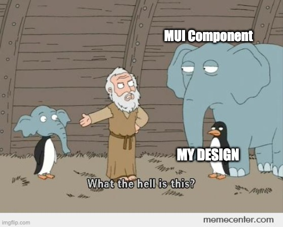
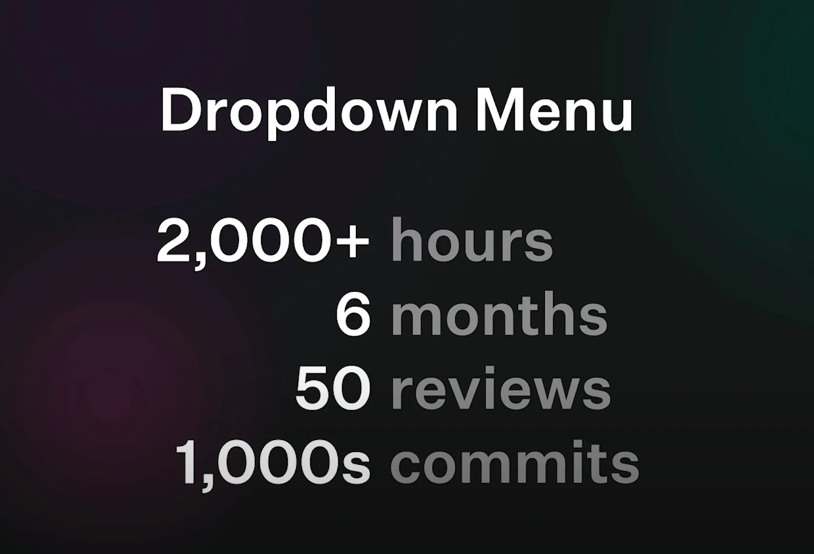
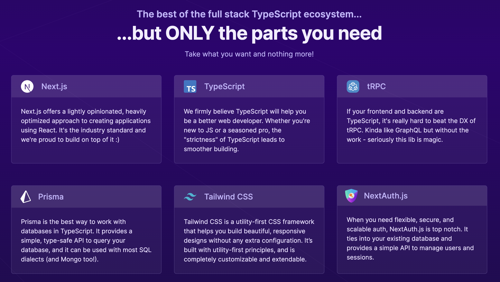

# Unleash the power of Headless Components

---

## 🚀 Introduction

### About Me

- Yedidya Rashi
- DevEx Developer at Next Insurance
- Passionate about web development, make my life as developer more enjoyable, cool open-source projects.
- In my spare time, I enjoy learning and experiment with computer science, math, and economics.
- some video games and dumb videos in tiktok

---


---

## 🏗️ Design System Requirements

- **♿ Accessibility**: Ensuring all components are accessible
- **🌓 Theming**: Support for multiple themes (e.g., light/dark mode)
- **🎨 Uniqueness**: Custom look and feel determined by the design team
- **🌐 Browser Support**: Support for all major browsers and IE11
- **🛠️ Functionality**: Custom behaviors tailored to your unique use cases
- **📱 Responsiveness**: Support for all screen sizes and devices
- **🧹 Maintainability**: Easy to modify and maintain

---



---

## Stage 1 - 🎢 Journey with UI Libraries

### React-Bootstrap

- Used for complicated components only
- Self-implemented atomic components like Button, Checkbox, Avatar

### Material-UI (MUI)

- Reason: Modern API and better theming support
- Benefits: Hooks, customization, and best practices integration
- Challenge: Struggles with complex custom components

---

## Stage 2 - 😅 The Struggles with Custom Components - Props Jungle


````md magic-move {lines: true}
```ts {*|1}
const Modal = ({ isOpen, onClose, title, children }) => {
  if (!isOpen) return null;

  return (
    <div className="modal">
      <div className="modal-header">
        <h2>{title}</h2>
        <button onClick={onClose}>Close</button>
      </div>
      <div className="modal-content">{children}</div>
    </div>
  );
};
```

```ts {6-7}
const Modal = ({
  isOpen,
  onClose,
  title,
  children,
  width,
  height,
})
```

```ts {8}
const Modal = ({
  isOpen,
  onClose,
  title,
  children,
  width,
  height,
  customClassName,
})
```

```ts {9-12}
const Modal = ({
  isOpen,
  onClose,
  title,
  children,
  width,
  height,
  customClassName,
  closeOnOverlayClick,
  onOpen,
  onCloseComplete,
})
```

```ts
const Modal = ({
  isOpen,
  onClose,
  title,
  children,
  width,
  height,
  customClassName,
  closeOnOverlayClick,
  onOpen,
  onCloseComplete,
  ...
})
```
````

<!--
Examples: Autocomplete, Combobox, Multi-tag-select, Dropdown, Modals

Issues: Difficulties in enforcing design and functionality

Conclusion: MUI was not flexible enough for unique needs
-->

---
layout: center
class: text-center
---



---

## 💡 Discovering Headless Components

- Introduction to Radix UI: Accessible components without styling

### Benefits Realized

- **♿ Accessibility**: Pre-built, well-tested components
- **🎨 Flexibility**: Complete control over design and rendering logic
- **🚀 Performance**: Reduced bundle size by importing only what's needed

---

## Available Headless Component Libraries

<br/>

### Radix UI

- Accessible primitives for building high-quality, accessible design systems and web apps.
- Components: Dialog, Dropdown Menu, Tooltip, Slider, and more.


### Headless UI

- Completely unstyled, fully accessible UI components, designed to integrate beautifully with Tailwind CSS.
- Components: Menu, Listbox, Combobox, Switch, Dialog, and more.

<br/>

### Reakit

- Accessible, composable, and reusable components for React.
- Components: Button, Checkbox, Dialog, Menu, Popover, and more.


### Downshift

- Primitives to build simple, flexible, WAI-ARIA compliant enhanced input React components.
- Components: Dropdown, Combobox, Autocomplete, and more.

---

## ⚖️ Pros and Cons of Headless Components

### Pros:

- Customization: Tailored to unique design and functionality needs
- Bundle Size: Only necessary code is included, reducing bloat
- Styling Freedom: Compatible with any styling solution

### Cons:

- Responsibility: More decisions and custom implementation required

---

## with great power comes great responsibility - You Own the style


---

## Introducing Shadcn

https://ui.shadcn.com/


---
layout: center
class: text-center
---
### Tech stack - [create T3 app](https://create.t3.gg/)



---


---

## Using Shadcn as the base for engineering metrics

- [v0.dev](https://v0.dev)

- first UI POC was delivered in **1 day**

- working MVP was delivered and less that **3 weeks**

---

## [Engineering Metrics](https://engineering-metrics.nextinsurance.io/)

---

## Credits

[Nir Ben-Yair](https://medium.com/@nirbenyair/headless-components-in-react-and-why-i-stopped-using-ui-libraries-a8208197c268)

---


---

## 👋 Thank You

- Q&A
