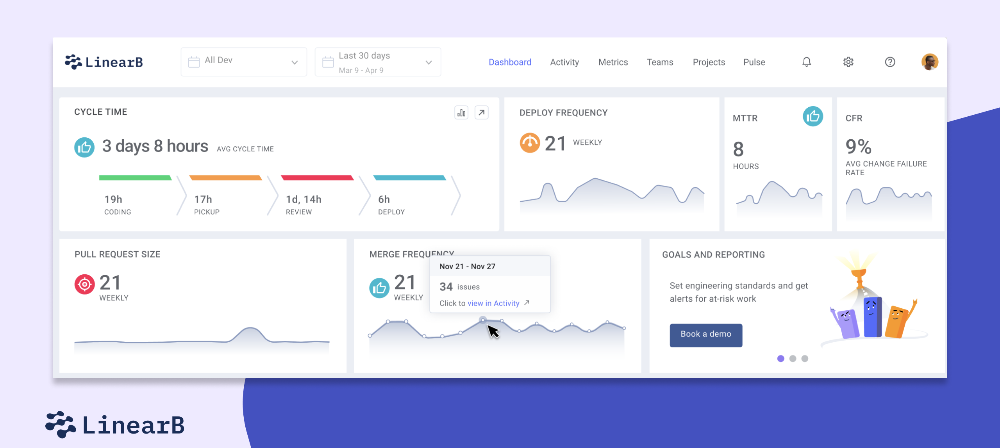

# Unleash the power of Headless Components

<!--
Who is frontend guy?

Who has ever written a frontend application here?

Who hates CSS?

Who loves CSS?
-->

---



<!--
redash is suck

how harder it will be to create something like this

lets try
-->

---


<!--
How much time did it take us?

today we will talk about the UI side of the project
-->

---
layout: image-right
image: https://media2.giphy.com/media/v1.Y2lkPTc5MGI3NjExYWlsOXBpcm9vdGw1aXdnMzRzeDQ2d3NkZXdhd3pjdnRrZHltdXpwNyZlcD12MV9pbnRlcm5hbF9naWZfYnlfaWQmY3Q9Zw/wzJ67MJMk6UMM/giphy.webp
---

## 🚀 Introduction

<br/>

### About Me

- **Name:** Yedidya Rashi
- **Role:** DevEx Developer at Next Insurance
- **Passion:** Web development & open-source projects
- **Free Time:** Computer science, economics, gaming, and wasting my time on TikTok

---
layout: image-right
image: https://i.giphy.com/10zsjaH4g0GgmY.webp
---

## 🏗️ Design System Requirements

<br/>

1. ♿ **Accessibility**
2. 🌓 **Theming**
3. 🎨 **Unique Design**
4. 🌐 **Cross-Browser Support**
5. 🛠️ **Custom Functionality**
6. 📱 **Responsiveness**
7. 🧹 **Maintainability**

<!--
show each of the of these requirements in the engineering metrics

https://engineering-metrics.nextinsurance.io/
-->

---
layout: image-right
image: /images/mui-meme.png
backgroundSize: 30em
---

## 🎢 The UI Library Rollercoaster

<br/>

### Stage 1: Exploration

1. **React-Bootstrap**
   - class name based styling

<br/>

2. **Material-UI (MUI)**
   - Modern API and improved theming
   - Integration of best practices
   - Limitation: Struggle with highly custom components

---

## 😅 Stage 2: The Props Jungle

### The Challenge of Custom Components

<br/>

````md magic-move {lines: true}
```ts {*|1}
const Modal = ({ isOpen, onClose, title, children }) => {
  if (!isOpen) return null;

  return (
    <div className="modal">
      <div className="modal-header">
        <h2>{title}</h2>
        <button onClick={onClose}>Close</button>
      </div>
      <div className="modal-content">{children}</div>
    </div>
  );
};
```

```ts {6-7}
const Modal = ({
  isOpen,
  onClose,
  title,
  children,
  width,
  height,
}) {
  ...
};
```

```ts {8}
const Modal = ({
  isOpen,
  onClose,
  title,
  children,
  width,
  height,
  customClassName,
}) {
  ...
};
```

```ts {9-12}
const Modal = ({
  isOpen,
  onClose,
  title,
  children,
  width,
  height,
  customClassName,
  closeOnOverlayClick,
  onOpen,
  onCloseComplete,
}) {
  ...
};
```

```ts
const Modal = ({
  isOpen,
  onClose,
  title,
  children,
  width,
  height,
  customClassName,
  closeOnOverlayClick,
  onOpen,
  onCloseComplete,
  ...
}) {
   // A minimum of 300 lines of logic should be tested for
   // Custom Functionality, Theming, Accessibility, Cross-Browser Support, Responsiveness, etc.
  ...
};
```
````

---
layout: image-right
image: /images/dropdown-menu.png
backgroundSize: 45em
---

# **Key Issues:**

- Prop explosion
- Difficulty in enforcing design consistency
- Limited flexibility for unique needs
- need to test things that we don't want to care about

---

## 💡 The Headless Revolution

<br/>

### Discovering Headless Components

<br/>

**Definition:** components with functionality and without pre-defined styling

<br/>

**Key Benefits:**

1. 📦 Functionality out of the box
2. ♿ Built-in accessibility
3. 🎨 Complete design control
4. 🚀 Optimized performance
5. 🧩 Flexible composition

<!--
Explain what is headless 

how can Use headless

inversion of control
-->

---

````md magic-move {lines: true}
```ts {*|3-6|7-13|*}
const Checkbox = () => {
  return (
    <CheckboxCards.Root
      defaultValue={["1"]}
      columns={{ initial: "1", sm: "3" }}
    >
      <CheckboxCards.Item value="1">
        <div className="my-custom-classname">
          <span style={{ background : "red" }}>
            Pro Mouse
          </span>
        </div>
      </CheckboxCards.Item>
      <CheckboxCards.Item value="2">
        <div className="my-custom-classname">
          <span style={{ background : "blue" }}>
            Pro Keyboard
          </span>
        </div>
      </CheckboxCards.Item>
    </CheckboxCards.Root>
  );
};
```
````

---

## Available Headless Component Libraries

<br/>

## 🛠️ Headless Component Libraries

<br/>

1. **Radix UI**
2. **Headless UI**
3. **Ariakit**
4. **Downshift**

---

## ⚖️ The Headless Trade-off

<br/>
<br/>

### Pros

- Styling freedom
- Reduced bundle size

<br/>

### Cons

- Increased responsibility for implementation

---
layout: center
class: text-center
---

## You Own the style


<!--
so we have two solutions but both have it downsides
-->

---

## 🎨 Shadcn: The Best of Both Worlds

<br/>
<br/>

### Features

- Pre-built, customizable components
- Based on Radix UI
- Themeable and accessible

<br/>
<br/>

### Ecosystem

- [shadcn/ui](https://ui.shadcn.com/)
- [shadcn/ui themes](https://ui.shadcn.com/themes)
- [Awesome shadcn](https://github.com/birobirobiro/awesome-shadcn-ui)

---


---

## 🚀 Case Study: Engineering Metrics Dashboard

<br/>

### Tech Stack

- [v0.dev](https://v0.dev)
- [Create T3 App](https://create.t3.gg/)
- Shadcn UI

<br/>

### Development Timeline

- UI Prototype: **1 day**
- Working MVP: **~ 3 weeks**

<br/>

---
layout: center
---

(https://v0.dev/r/2Z7gqX8DE68)

---
layout: center
---

(https://v0.dev/r/uFCJrZJYalj)

---

## live demo

```bash
pnpm create t3-app shadcn-demo
cd shadcn-demo
pnpx shadcn@latest init
pnpx v0 add huIjY9GKcLA
code .
```

```bash
pnpx shadcn@latest add dialog
pnpx shadcn@latest add label
```

---
layout: center
---

<Tweet id="1830761040872906764" />

---

## 🎓 Key Takeaways

<br/>

1. Headless components offer the ultimate flexibility
2. Shadcn provides a balanced approach for many projects

---

## 📚 Further Reading

<br/>

- [Nir Ben-Yair's Article on Headless Components](https://medium.com/@nirbenyair/headless-components-in-react-and-why-i-stopped-using-ui-libraries-a8208197c268)
- [Radix UI Documentation](https://www.radix-ui.com/)
- [Headless UI Documentation](https://headlessui.dev/)
- [Create T3 App Documentation](https://create.t3.gg/)

---
layout: center
class: text-center
transition: none
---

# 🙏 Special Thanks

### Tamir Zur & DevEx team

---
layout: image
image: https://i0.wp.com/blackboardradio.com/wp-content/uploads/2023/11/6453afe8a20709436882f952_qna-min.png?fit=2000%2C1127&ssl=1
transition: none
---

---
layout: image-right
image: https://i.giphy.com/dRvEZLV0ORAmHT1L5u.webp
---

## 👋 Thank You
